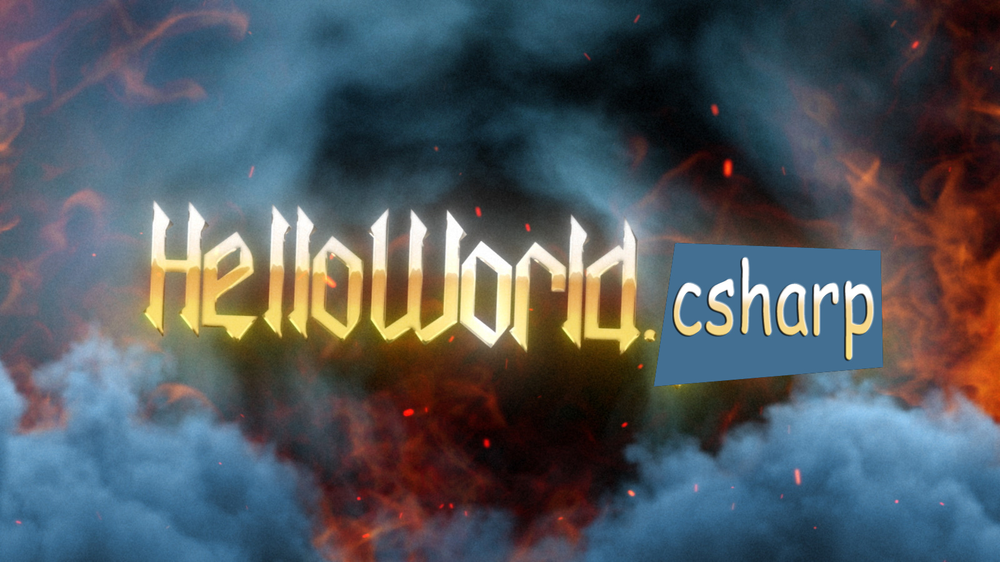

# HelloWorld.csharp

Welcome to the converted version of the first **Nanowar Of Steel** GitHub project. This revised repository is aimed to all those programmers out there who indentify themselves as C# developers.

Some important notes:
1. To maintain the song sorce code as close as possible to the original, I mixed common C# conventions with those adopted in the java version: the `foo` property should have been `_foo`, but in my personal opinion it would have make the song unsingable
2. System is redundant, it's there to keep up with the metric
3. Due to the different behavior of the `Lenght` property on the `String` class, I opted for an invokable method instead, using `.Trim()`
4. The thrown exception, although similar to the original one, is instead a `NullReferenceException`